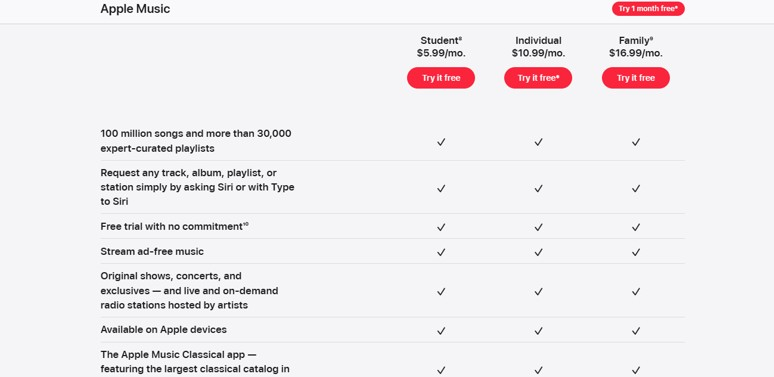
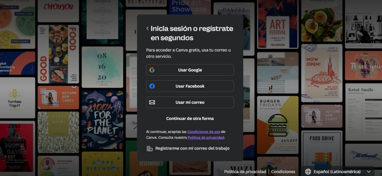

# Integrantes:

- **Daniel Arce Campos** - Carnet: 2024174489
- **Natalia Orozco Delgado** - Carnet: 2024099161

---

# Listado de Entidades

- **Usuarios**
- **Email**
- **Dirección**
- **Empresas**
- **Roles**
- **Servicios**
- **Métodos de Pago**
- **Horarios**
- **Subscripciones**
- **Idiomas**
- **Países**
- **Inicios de Sesión**
- **Transacciones Bancarias**

---

## Capturas de Formatos como Referencia

### Horario


### Planes



### Inicio sesión



### Dirección


### Moneda


### Métodos de pago


### Transacciones Bancarias


# Usuarios de la plataforma que esten activos con su nombre completo, email, país de procedencia, y el total de cuánto han pagado en subscripciones desde el 2024 hasta el día de hoy
### Script de consulta
```sql
SELECT 
    CONCAT(payment_users.firstname, ' ', payment_users.lastname) AS nombre_completo,
    payment_users.email,
    payment_countries.name AS pais,
    SUM(payment_payment.amount) AS total_pagado_crc
FROM payment_users
    INNER JOIN payment_useraddress ON payment_users.userid = payment_useraddress.userid
    INNER JOIN payment_addresses ON payment_useraddress.addressid = payment_addresses.addressid
    INNER JOIN payment_cities ON payment_addresses.cityid = payment_cities.cityid
    INNER JOIN payment_states ON payment_cities.stateid = payment_states.stateid
    INNER JOIN payment_countries ON payment_states.countryid = payment_countries.countryid
    INNER JOIN payment_planperson ON payment_users.userid = payment_planperson.userid
    INNER JOIN payment_payment ON payment_users.userid = payment_payment.userid
WHERE 
    payment_planperson.enabled = 1 
    AND payment_payment.date >= '2024-01-01'
GROUP BY 
    payment_users.userid, payment_users.firstname, payment_users.lastname, payment_users.email, payment_countries.name 
ORDER BY 
    total_pagado_crc DESC;
```

### Datatable resultante

| nombre_completo         | email                  | pais          | total_pagado_crc |
|-------------------------|------------------------|---------------|------------------|
| Nombre27 Apellido27     | usuario27@gmail.com    | United States | 10734            |
| Nombre13 Apellido13     | usuario13@gmail.com    | Panamá        | 10351            |
| Nombre24 Apellido24     | usuario24@gmail.com    | United States | 10314            |
| Nombre18 Apellido18     | usuario18@gmail.com    | United States | 9851             |
| Nombre3 Apellido3       | usuario3@gmail.com     | Costa Rica    | 9760             |
| Nombre7 Apellido7       | usuario7@gmail.com     | United States | 9672             |
| Nombre28 Apellido28     | usuario28@gmail.com    | Costa Rica    | 9293             |
| Nombre23 Apellido23     | usuario23@gmail.com    | Costa Rica    | 8859             |
| Nombre22 Apellido22     | usuario22@gmail.com    | United States | 8756             |
| Nombre2 Apellido2       | usuario2@gmail.com     | Costa Rica    | 8742             |
| Nombre30 Apellido30     | usuario30@gmail.com    | Costa Rica    | 8676             |
| Nombre10 Apellido10     | usuario10@gmail.com    | Puerto Rico   | 7979             |
| Nombre17 Apellido17     | usuario17@gmail.com    | United States | 7872             |
| Nombre8 Apellido8       | usuario8@gmail.com     | Costa Rica    | 7824             |
| Nombre12 Apellido12     | usuario12@gmail.com    | Costa Rica    | 7724             |
| Nombre14 Apellido14     | usuario14@gmail.com    | Puerto Rico   | 7578             |
| Nombre20 Apellido20     | usuario20@gmail.com    | United States | 6130             |
| Nombre5 Apellido5       | usuario5@gmail.com     | Costa Rica    | 5765             |
| Nombre16 Apellido16     | usuario16@gmail.com    | Costa Rica    | 5108             |
| Nombre15 Apellido15     | usuario15@gmail.com    | United States | 4771             |
| Nombre6 Apellido6       | usuario6@gmail.com     | United States | 4591             |
| Nombre25 Apellido25     | usuario25@gmail.com    | United States | 3926             |
| Nombre26 Apellido26     | usuario26@gmail.com    | Costa Rica    | 3609             |
| Nombre19 Apellido19     | usuario19@gmail.com    | Costa Rica    | 3551             |
| Nombre4 Apellido4       | usuario4@gmail.com     | United States | 2766             |
| Nombre9 Apellido9       | usuario9@gmail.com     | Costa Rica    | 2765             |
| Nombre21 Apellido21     | usuario21@gmail.com    | Costa Rica    | 2578             |
| Nombre1 Apellido1       | usuario1@gmail.com     | United States | 1764             |
| Nombre11 Apellido11     | usuario11@gmail.com    | Costa Rica    | 1689             |
| Nombre29 Apellido29     | usuario29@gmail.com    | Costa Rica    | 1644             |

#  personas con su nombre completo e email, los cuales le queden menos de 15 días para tener que volver a pagar una nueva subscripción
### Script de consulta
```sql
SELECT 
    CONCAT(payment_users.firstname, ' ', payment_users.lastname) AS nombre_completo,
    payment_users.email,
    DATEDIFF(payment_planperson.expirationdate, CURDATE()) AS dias_restantes
FROM payment_users
INNER JOIN payment_planperson ON payment_users.userid = payment_planperson.userid
WHERE 
    payment_planperson.enabled = 1 
    AND DATEDIFF(payment_planperson.expirationdate, CURDATE()) < 15 
ORDER BY 
    dias_restantes ASC;
```
### Datatable resultante
| nombre_completo         | email                  | dias_restantes |
|-------------------------|------------------------|----------------|
| Nombre14 Apellido14     | usuario14@gmail.com    | 1              |
| Nombre1 Apellido1       | usuario1@gmail.com     | 3              |
| Nombre28 Apellido28     | usuario28@gmail.com    | 3              |
| Nombre4 Apellido4       | usuario4@gmail.com     | 4              |
| Nombre26 Apellido26     | usuario26@gmail.com    | 4              |
| Nombre21 Apellido21     | usuario21@gmail.com    | 4              |
| Nombre25 Apellido25     | usuario25@gmail.com    | 5              |
| Nombre15 Apellido15     | usuario15@gmail.com    | 5              |
| Nombre19 Apellido19     | usuario19@gmail.com    | 6              |
| Nombre8 Apellido8       | usuario8@gmail.com     | 7              |
| Nombre29 Apellido29     | usuario29@gmail.com    | 8              |
| Nombre7 Apellido7       | usuario7@gmail.com     | 8              |
| Nombre5 Apellido5       | usuario5@gmail.com     | 9              |
| Nombre27 Apellido27     | usuario27@gmail.com    | 9              |
| Nombre18 Apellido18     | usuario18@gmail.com    | 9              |
| Nombre17 Apellido17     | usuario17@gmail.com    | 9              |
| Nombre12 Apellido12     | usuario12@gmail.com    | 9              |
| Nombre23 Apellido23     | usuario23@gmail.com    | 11             |
| Nombre24 Apellido24     | usuario24@gmail.com    | 11             |
| Nombre10 Apellido10     | usuario10@gmail.com    | 11             |
| Nombre20 Apellido20     | usuario20@gmail.com    | 12             |
| Nombre3 Apellido3       | usuario3@gmail.com     | 12             |
| Nombre13 Apellido13     | usuario13@gmail.com    | 13             |
| Nombre30 Apellido30     | usuario30@gmail.com    | 14             |
| Nombre6 Apellido6       | usuario6@gmail.com     | 14             |
| Nombre2 Apellido2       | usuario2@gmail.com     | 14             |


# top 15 de usuarios que más uso le dan a la aplicación
### Script de consulta
```sql
SELECT 
    payment_users.userid, 
    CONCAT(payment_users.firstname, ' ', payment_users.lastname) AS fullname, 
    COUNT(payment_logs.logsid) AS login_count
FROM payment_logs 
INNER JOIN payment_users ON payment_logs.username = CONCAT(payment_users.firstname, ' ', payment_users.lastname)
WHERE 
    payment_logs.logtypesid = (SELECT logtypesid FROM payment_logtypes WHERE name = 'Login')
GROUP BY 
    payment_users.userid, payment_users.firstname, payment_users.lastname
ORDER BY 
    login_count DESC
LIMIT 15;
```
### Datatable resultante
| userid | fullname             | login_count |
|--------|----------------------|-------------|
| 24     | Nombre24 Apellido24  | 7           |
| 29     | Nombre29 Apellido29  | 7           |
| 4      | Nombre4 Apellido4    | 7           |
| 25     | Nombre25 Apellido25  | 6           |
| 21     | Nombre21 Apellido21  | 5           |
| 9      | Nombre9 Apellido9    | 5           |
| 5      | Nombre5 Apellido5    | 4           |
| 8      | Nombre8 Apellido8    | 4           |
| 18     | Nombre18 Apellido18  | 4           |
| 13     | Nombre13 Apellido13  | 4           |
| 22     | Nombre22 Apellido22  | 3           |
| 6      | Nombre6 Apellido6    | 3           |
| 28     | Nombre28 Apellido28  | 3           |
| 17     | Nombre17 Apellido17  | 3           |
| 2      | Nombre2 Apellido2    | 3           |

#  top 15 que menos uso le dan a la aplicación 
### Script de consulta
```sql
SELECT 
    payment_users.userid, 
    CONCAT(payment_users.firstname, ' ', payment_users.lastname) AS fullname, 
    COUNT(payment_logs.logsid) AS login_count
FROM 
    payment_logs 
INNER JOIN payment_users ON payment_logs.username = CONCAT(payment_users.firstname, ' ', payment_users.lastname)
WHERE 
    payment_logs.logtypesid = (SELECT logtypesid FROM payment_logtypes WHERE name = 'Login')
GROUP BY 
    payment_users.userid, payment_users.firstname, payment_users.lastname
ORDER BY 
    login_count ASC
LIMIT 15;  
```
### Datatable resultante
| userid | fullname             | login_count |
|--------|----------------------|-------------|
| 15     | Nombre15 Apellido15  | 1           |
| 16     | Nombre16 Apellido16  | 1           |
| 11     | Nombre11 Apellido11  | 2           |
| 10     | Nombre10 Apellido10  | 2           |
| 27     | Nombre27 Apellido27  | 2           |
| 20     | Nombre20 Apellido20  | 2           |
| 7      | Nombre7 Apellido7    | 2           |
| 1      | Nombre1 Apellido1    | 2           |
| 22     | Nombre22 Apellido22  | 3           |
| 3      | Nombre3 Apellido3    | 3           |
| 28     | Nombre28 Apellido28  | 3           |
| 26     | Nombre26 Apellido26  | 3           |
| 17     | Nombre17 Apellido17  | 3           |
| 12     | Nombre12 Apellido12  | 3           |
| 2      | Nombre2 Apellido2    | 3           |


# determinar cuáles son los análisis donde más está fallando la AI, encontrar los casos, situaciones, interpretaciones, halucinaciones o errores donde el usuario está teniendo más problemas en hacer que la AI determine correctamente lo que se desea hacer, rankeando cada problema de mayor a menor cantidad de ocurrencias entre un rango de fechas (1 mes)

### Script de consulta
```sql
SELECT 
    payment_humanAIinteractions.feedback AS tipo_error, 
    COUNT(*) AS ocurrencias
FROM payment_humanAIinteractions 
WHERE 
    payment_humanAIinteractions.timestamp BETWEEN NOW() - INTERVAL 30 DAY AND NOW() 
GROUP BY 
    payment_humanAIinteractions.feedback 
ORDER BY 
    ocurrencias DESC;
```

### Datatable resultante
| tipo_error              | ocurrencias |
|-------------------------|-------------|
| alucinación detectada   | 10          |
| timeout                 | 8           |
| fallo en la interpretación | 7         |
| input inválido          | 6           |
| contexto incorrecto     | 4           |

